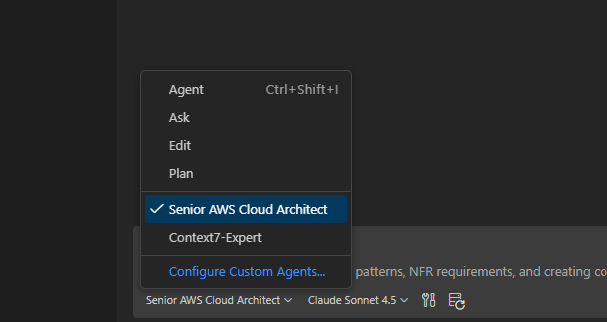
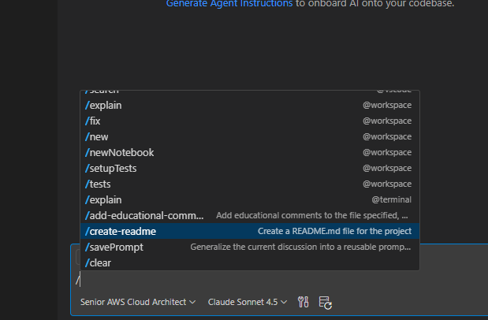
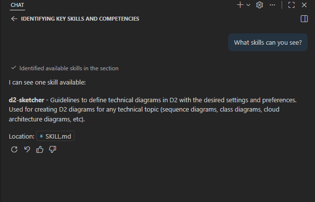

# awesome-copilot-custom-agents

Custom configurations for Copilot agents, instructions, prompts and other beasts :dragon_face:

## :question:  What is the content about?

It is about customizations based on *well-known prompt engineering techniques and standards* accepted by most of the current AI agents that can be applied to tailor the usage of those **AI agents** to steer them towards specific tasks and output retrievals.

The following featured content can be found:

- **Custom Agents**: Pre-configured agents for specific tasks.
- **Prompts**: Ready-to-use prompts for various scenarios.
- **Instructions**: Guidelines to optimize agent performance.
- **Skills**: Ready-to-use sets of skills supported by AI agents like Copilot or Claude.
- **MCP**: MCP configurations to use together with previous skills and custom agents (as a reference).
- **Others**: Additional tools or resources used to play with AI agents (Docker files, etc).

## :rocket:  How to use it?

- Clone the repository.
- Copy the content you wished to use to your local AI environment.
- Tweak it to your needs and start using it.

### Usage with VS Code and Copilot

I have used these customizations with the below setup:

- VS Code 1.108.2
- Custom prompts, instructions and agents are copied to `%APPDATA%/Code/User/prompts` (in theory this is configurable using the Copilot settings, but that is the default location for my installation).
- Custom skill must be copied to `%USERPROFILE%/.copilot/skills`.

If the previous is done:

- **Custom agents** will show up as an agent option from the Copilot console.

    

- **Custom prompts and instructions** will be also available from the respective dropdowns in the Copilot console or they can be invoked using the proper syntax (for *prompts*). Custom instructions should be automatically loaded by the agent based on the provided prompt and the custom instructions metadata.

    

- **Custom skills** will be visible to any agent. Ask the agent to indicate what skills are available, for example.

    

## :scroll: The collection

The following can be found within this repository.

### Custom agents

Under the `agents` folder, the below custom agents:

| Agent Name | Agent Definition | Purpose | Tools |
|------------|------------------|---------|-------|
| Context7 Agent | [context7.agent.md](./agents/context7.agent.md) | Invoke [Context7](https://context7.com/) API to retrieve latest updates on proposed software libraries and tools. Originally obtained from [here](https://github.com/github/awesome-copilot/blob/main/agents/context7.agent.md). | Context7 MCP server |
| AWS Solutions Architect Agent | [awsarch.agent.md](./agents/awsarch.agent.md) | Specialized **AWS solutions architect** with extra capabilities to draft an overall AWS solution and render all the necessary diagrams and scaffold some *Terraform code to kick off the project (pending)*. | AWS Knowledge MCP server, AWS Documentation MCP server, custom D2 skill, *custom Terraform skill (pending)* | 

### Custom skills

Under the skills folder, the below custom skills for usage with AI agents can be found:

| Skill Name | Skill Definition | Purpose |
|------------|------------------|---------|
| D2 Skill | [d2-sketcher](./skills/d2-sketcher/SKILL.md) | Generate diagrams using [D2](https://d2lang.com/) language. |

### Custom instructions

Under the `instructions` folder, the below custom instructions can be found:

| Instruction Name | Instruction Definition | Purpose |
|------------------|------------------------|---------|
| Markdown Instruction | [markdown.instruction.md](./instructions/markdown.instructions.md) | Guidelines to write Markdown files. Originally from [here](https://github.com/github/awesome-copilot/blob/main/instructions/markdown.instructions.md).|

### Custom prompts

Under the `prompts` folder, the below custom prompts can be found:

| Prompt Name | Prompt Definition | Purpose |
|-------------|-------------------|---------|
| Educational Comments | [add-educational-comments.prompt.md](./prompts/add-educational-comments.prompt.md) | Add comments to existing file to provide educational details to enrich it and improve understanding. Originally obtained from [here](https://github.com/github/awesome-copilot/blob/main/prompts/add-educational-comments.prompt.md). |
| Create Readme | [create-readme.prompt.md](./prompts/create-readme.prompt.md) | Guidelines to crate a README file. Originally from [here](https://github.com/github/awesome-copilot/blob/main/prompts/create-readme.prompt.md). |

## :computer: MCP servers

**MCP servers** are a very valuable tool that will enhance the performance and accuracy of the AI agents when used. Some of the previous agents will leverage MCP servers to retrieve additional information or more up-to-date and accurate details on the treated topics, like software libraries, official documentation, recommended practices, etc.

For the MCP servers used with the custom agents defined in this repository, a reference to the corresponding setup can be found under the `mcp` folder. **This is done on a Windows environment using VS Code**. Nevertheless, it is recomended to inspect the official websites for those servers to get the latest update and a detailed explanation on how to configure them for the different environments.

> **IMPORTANT** Ensure the MCP servers are running before prompting the agent if you want to use them!
